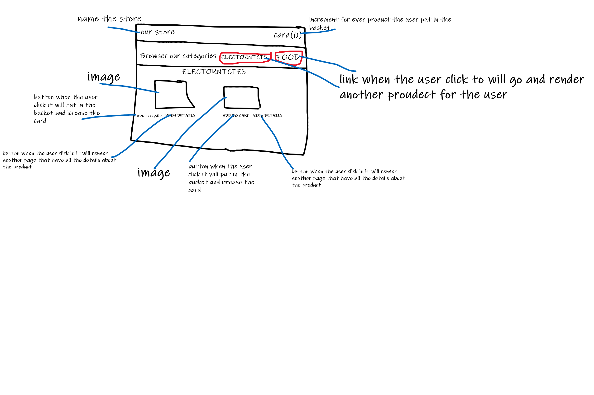
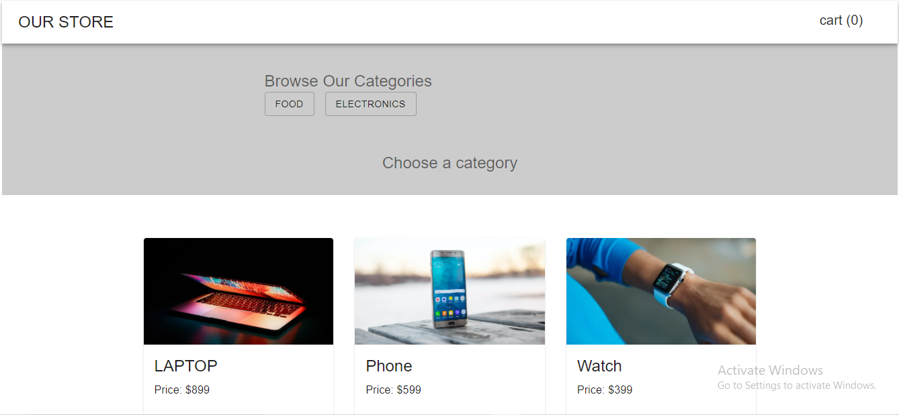
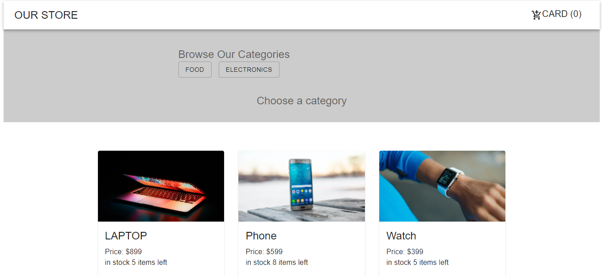

# StoreFront

## this create be student learn Redux and it Store have product.

## the user can see the product in department and can add the product he want to bucket.

--------------------

# lab(36)

[deploylink](https://naeemmusamh.github.io/storefront/)

[Pull Request](https://github.com/naeemmusamh/storefront/pull/1)

[Full Code](https://github.com/naeemmusamh/storefront)

# structure

------------------------------

# lab(37)

[deploylink](https://naeemmusamh.github.io/storefront/)

[Pull Request](https://github.com/naeemmusamh/storefront/pull/2)

[Full Code](https://github.com/naeemmusamh/storefront)

# structure

# the package that using in this app

[react](https://www.npmjs.com/package/react)

[react-dom](https://www.npmjs.com/package/react-dom)

[react-scripts](https://www.npmjs.com/package/react-scripts)

[react-redux](https://www.npmjs.com/package/react-redux)

[redux](https://www.npmjs.com/package/redux)

[Material-UI](https://www.npmjs.com/package/@material-ui/core)

[material-ui-icon](https://material-ui.com/components/material-icons/)

[redux-devtools-extension](https://www.npmjs.com/package/redux-devtools-extension)

[gh-pages](https://www.npmjs.com/package/gh-pages)
